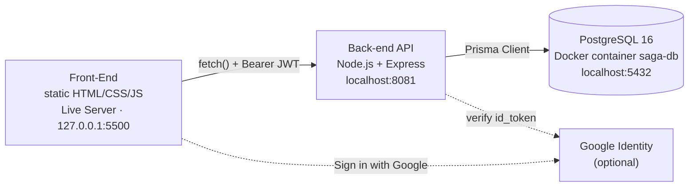
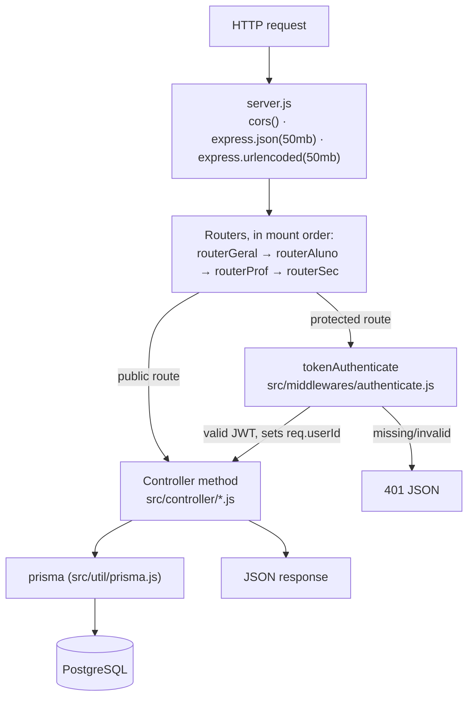
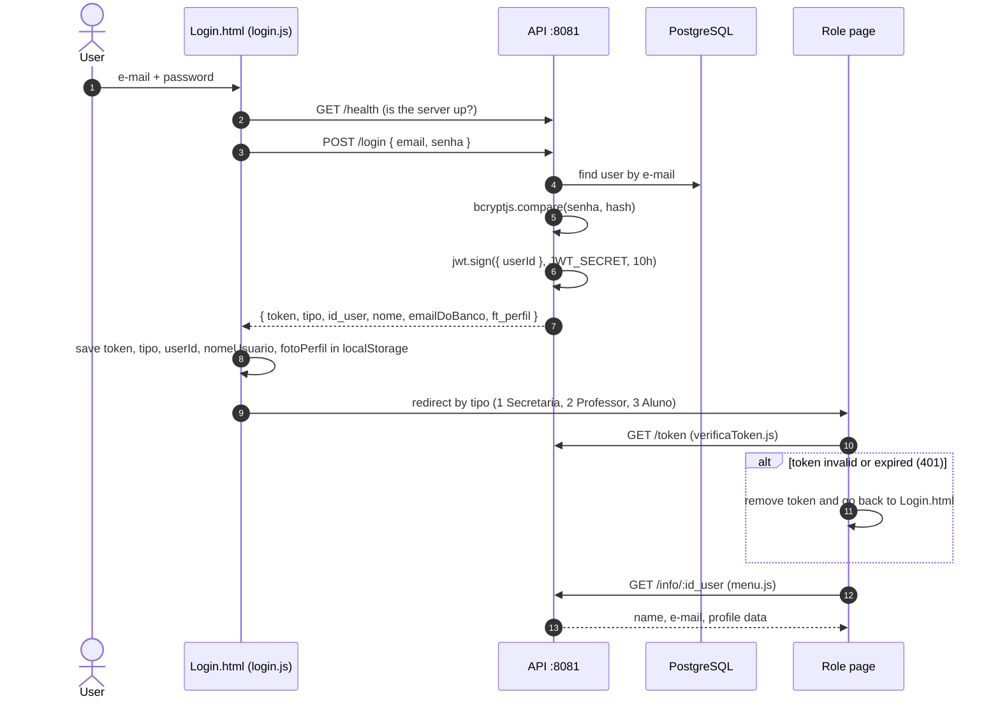
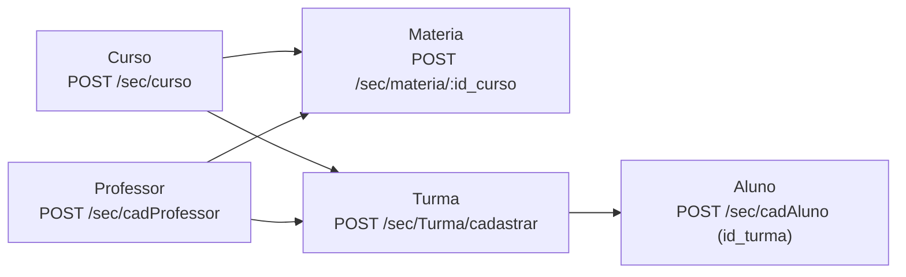

# SAGA Architecture

🌐 **English** | [Português (Brasil)](pt-BR/architecture.md)

How the system is put together **today**, and where the backlog is taking it. Read this before
changing code in an area you don't know yet.

> 📌 This document describes the code as it is, including its rough edges. Defects are summarized
> here and tracked in [known-issues.md](known-issues.md) and in the
> [GitHub issues](https://github.com/ftfariasdev/SAGA/issues).

## Contents

1. [Big picture](#1-big-picture)
2. [Repository layout](#2-repository-layout)
3. [Back-end](#3-back-end)
4. [Front-end](#4-front-end)
5. [Authentication and session flow](#5-authentication-and-session-flow)
6. [User roles](#6-user-roles)
7. [Main domain flows](#7-main-domain-flows)
8. [Where the architecture is heading](#8-where-the-architecture-is-heading)
9. [Where to change what](#9-where-to-change-what)

---

## 1. Big picture

SAGA is three independent pieces that talk over HTTP and SQL. There is no build step and no
server-side rendering.



| Piece     | Technology                             | Address                 | Details                                       |
| --------- | -------------------------------------- | ----------------------- | --------------------------------------------- |
| Front-end | HTML5, CSS3, vanilla JavaScript (ES6+) | `http://127.0.0.1:5500` | [Front-End/README.md](../Front-End/README.md) |
| API       | Node.js 22, Express 4, Prisma 6, JWT   | `http://localhost:8081` | [Back-end/README.md](../Back-end/README.md)   |
| Database  | PostgreSQL 16 in Docker (`saga-db`)    | `localhost:5432`        | [database.md](database.md)                    |

Two addresses are **hardcoded** and must match for the system to work:

- The front-end calls `http://localhost:8081` in every page script, so the API must run with
  `PORT=8081`.
- The API's CORS configuration in [`Back-end/server.js`](../Back-end/server.js) only accepts the
  origin `http://127.0.0.1:5500`. Opening pages via `file://` or `localhost:5500` fails.

Setup instructions live in [local-environment.md](local-environment.md).

---

## 2. Repository layout

```text
SAGA/
├── .github/
│   ├── workflows/            lint.yml, prettier.yml — run on push/PR to main and develop
│   └── pull_request_template.md
├── Back-end/                 REST API (its own package.json)
│   ├── prisma/
│   │   ├── schema.prisma     data model
│   │   └── migrations/       versioned schema history
│   ├── src/
│   │   ├── Routes/           routesGeral.js, routesAluno.js, routesProf.js, routesSec.js
│   │   ├── controller/       loginController.js, commonController.js, alunoController.js,
│   │   │                     profController.js, secController.js
│   │   ├── middlewares/      authenticate.js (JWT check)
│   │   └── util/             prisma.js (shared PrismaClient)
│   ├── tests/                *.http request collections (manual, not automated tests)
│   ├── server.js             entry point
│   ├── docker-compose.yml    PostgreSQL container
│   ├── .env.example          environment variable template
│   └── cadMateria.js, fixMateria.js, sync_professores_turmas.js, baseline.sql  (loose scripts / legacy)
├── Front-End/                static site (no package.json, no build)
│   ├── index.html            redirects to Login/Login.html
│   ├── Login/  Aluno/  Professor/  Secretaria/   one folder per role: Page/, Js/, Css/ (css/)
│   ├── Js/                   shared scripts: verificaToken.js, menu.js, mascaras.js
│   ├── Css Base/             shared styles
│   └── Img/
├── docs/                     documentation (EN-US); docs/pt-BR/ holds every PT-BR translation
├── eslint.config.js          ESLint flat config for the whole repo
├── .prettierrc               Prettier rules
├── package.json              root: lint/format tooling only (no app code)
├── README.md  CONTRIBUTING.md  CLAUDE.md
```

The root `package.json` exists only to run `npm run lint` and `npm run format:check` across both
applications. The API has its own dependencies in `Back-end/package.json`.

---

## 3. Back-end

### Request pipeline



**`server.js`** loads `.env` with `dotenv`, configures CORS (single origin
`http://127.0.0.1:5500`), raises the body limit to 50 MB (profile photos travel as strings),
mounts the four routers and starts listening on `PORT`. It also exports `JWT_SECRET`, which
`loginController.js` imports.

> `server.js` declares its own `GET /health`, but `routerGeral` is mounted first and already
> answers `/health` with `{ "status": "UP", "timestamp": "...", "version": "1.0.0" }`. The
> handler in `server.js` is never reached.

**`tokenAuthenticate`** reads `Authorization: Bearer <token>`, verifies it with `JWT_SECRET` and
stores the `userId` claim in `req.userId`. It does **not** check the user's role: any logged-in
user can call any protected route, including `/sec/*`. Role-based authorization is planned in
[S1] #14 and [S2] #15.

**Controllers** are classes whose methods receive `(req, res)`, validate inputs by hand, call
Prisma directly and build the response. There is no service or repository layer, so business
rules live inside controllers — for example, the rule "a professor assigned to a subject is
linked to every class of that course" is implemented inline in `SecController.cadMateria` and
`editarMateria`.

**`src/util/prisma.js`** exports one shared `PrismaClient`. The maintenance scripts create their
own client ([F4] #6).

### Routers

| Router        | File             | Controller(s)                         | Paths                                                                  | Routes | Used by             |
| ------------- | ---------------- | ------------------------------------- | ---------------------------------------------------------------------- | -----: | ------------------- |
| `routerGeral` | `routesGeral.js` | `LoginController`, `commonController` | `/login`, `/login/google`, `/token`, `/health`, `/info`, `/editarInfo` |      6 | Every role          |
| `routerAluno` | `routesAluno.js` | `AlunoController`                     | `/aluno/*`                                                             |      6 | Student pages       |
| `routerProf`  | `routesProf.js`  | `ProfController`                      | `/prof/*`, `/professor/user/:id_user`                                  |      9 | Teacher pages       |
| `routerSec`   | `routesSec.js`   | `SecController`                       | `/sec/*`                                                               |     33 | School office pages |

Public routes (no token): `POST /login`, `POST /login/google`, `GET /health` and
`POST /sec/cadSecretaria` (open on purpose to bootstrap the first account — to be closed in
[C1] #1). Every route is listed in [api-reference.md](api-reference.md).

### Things to know before editing

- **Two binding styles.** `routesAluno.js` and `routesProf.js` wrap each call in an arrow
  function (`(req, res) => controller.method(req, res)`), so `this` works. `routesGeral.js` and
  `routesSec.js` pass the method reference directly (`secController.cadCurso`), so `this` is
  `undefined` inside those methods. No method uses `this` today — if you add a helper and call it
  with `this.helper()` from one of those controllers, it will crash.
- **Async errors are not caught globally.** Express 4 does not handle rejected promises. When a
  handler without its own `try/catch` (for example the course CRUD in `SecController` and
  `LoginController.auth`) hits a Prisma error, the rejection goes unhandled and Node.js (15+)
  **terminates the whole API process**. A global error handler is planned in [F1] #3.
- **Error body shape is inconsistent**: `{ erro }`, `{ error }`, `{ message }` and `{ mensagem }`
  all appear.
- **Two bcrypt libraries**: `SecController` hashes with `bcrypt`, `LoginController` compares with
  `bcryptjs` ([F10] #12).
- **Loose files in `Back-end/`**: `cadMateria.js` (not imported anywhere),
  `src/controller/profController_fixed.js` (empty), and the CLI scripts `fixMateria.js` and
  `sync_professores_turmas.js`. See [known-issues.md](known-issues.md) and [F9] #11.

---

## 4. Front-end

- **Vanilla HTML/CSS/JS**, no framework, no bundler, no `package.json`. Each HTML page loads its
  scripts with `<script src>`.
- **One folder per role** — `Login/`, `Aluno/`, `Professor/`, `Secretaria/` — each with `Page/`
  (HTML), `Js/` (page scripts) and `Css/` (`css/` in `Secretaria`).
- **Shared code** in `Front-End/Js/`:
  - `verificaToken.js` — on page load, calls `GET /token`; on `401` it removes the token and
    redirects to the login page.
  - `menu.js` — fills the header (name, e-mail, photo) from `localStorage` and refreshes it from
    `GET /info/:id_user`; handles the logout button (`localStorage.clear()`).
  - `mascaras.js` — input masks for CPF and phone.
- **Shared styles** in `Front-End/Css Base/` (base layout, tables, modal, search bar).
- **API calls**: each page script calls `fetch('http://localhost:8081/...')` with the URL written
  inline and the token read from `localStorage`. There is no central HTTP client yet ([FE1] #37).
- **CDN libraries**:
  - `Login/Login.html`: Bootstrap 4.5.2, jQuery 3.5.1 slim, Popper 1.16.1 and Google Identity
    Services.
  - `Aluno/Page/Freq1.html` and `Freq2.html`: Chart.js, chartjs-plugin-datalabels 2.2.0 and
    FullCalendar 6.1.8.

The full page → script → endpoint map is in [Front-End/README.md](../Front-End/README.md).

---

## 5. Authentication and session flow



Key facts:

- **Token**: HS256 JWT signed with `JWT_SECRET`, payload `{ userId }` only, expires in **10
  hours**. There is no refresh token and no server-side logout; logging out just clears
  `localStorage`.
- **Redirect targets**: `tipo` `1` → `Secretaria/Page/HomeSecretaria.html`, `2` →
  `Professor/Page/HomeProfessor.html`, `3` → `Aluno/Page/HomeAluno.html`.
- **`localStorage` keys** written at login: `token`, `tipo`, `userId`, `nomeUsuario`,
  `emailUsuario`, `fotoPerfil`. The API returns the e-mail as `emailDoBanco`, but the
  password-login script reads `data.email`, so `emailUsuario` is only filled once `menu.js` calls
  `/info`.
- **Google sign-in**: the Google button returns an `id_token`; the front-end posts it to
  `POST /login/google`, and the API verifies it with `google-auth-library` using
  `GOOGLE_CLIENT_ID`. If the e-mail is unknown, the API **creates a user with `tipo: 0`** and
  placeholder phone/CPF ([S5] #18). The front-end has no home page for `tipo 0`, so that user is
  sent back to the login page.
- **Authorization**: none beyond "has a valid token". Role in the token and a per-role middleware
  are planned in [S1] #14 and [S2] #15; the IDOR on `/info/:id_user` and `PUT /editarInfo` is
  tracked in [S4] #17.

---

## 6. User roles

Every person is a row in `user`; the `tipo` column says which profile table they also have.

| `tipo` | Role                        | Profile table | What they do in the UI                                                                                                         |
| -----: | --------------------------- | ------------- | ------------------------------------------------------------------------------------------------------------------------------ |
|    `0` | Google auto-created account | —             | Nothing: no home page exists for this value.                                                                                   |
|    `1` | Secretaria (school office)  | `secretaria`  | Manages courses, subjects, classes and users; assigns teachers and students to classes; edits own profile (`editarInfo.html`). |
|    `2` | Professor (teacher)         | `professor`   | Sees their classes and subjects, takes roll call, posts grades.                                                                |
|    `3` | Aluno (student)             | `aluno`       | Sees their course subjects, attendance and grades; views own profile (read-only).                                              |

> ⚠️ These values are stored in the database. **Never renumber them** — existing rows would
> change role silently.

---

## 7. Main domain flows

Domain words are Portuguese in the code; see [glossary.md](glossary.md).

### School office sets up the academic structure



1. Create a **curso** (course/program).
2. Create its **matérias** (subjects). If a subject is created or edited with a professor
   (`id_prof`), the API links that professor to **every turma of the course** through
   `professor_turma`.
3. Create **turmas** (classes) for the course, optionally with an initial professor.
4. Register users: `cadAluno` (with `id_turma`), `cadProfessor`, `cadSecretaria`. Each creates a
   `user` row plus the matching profile row.

### Teacher takes roll call

`POST /prof/chamada` with `{ id_turma, data, presencas: [{ id_aluno, presente }] }`. The API checks
that the teacher is linked to the class, finds or creates one **chamada** for
(teacher, class, exact timestamp) and upserts one **presenca** per student. Date semantics are
being unified in [D6] #28.

### Teacher posts grades

`POST /prof/lancarNotas` with `{ id_turma, id_materia, tipo_avaliacao, bimestre, notas: [{ id_aluno, valor }] }`.
The teacher must be linked to the class **and** be the subject's `id_prof`. Values must be
between 0 and 10. For each student the API creates a **nota** row (teacher, class, subject,
assessment type, term) with one **nota_aluno** row holding the value. Posting again creates new
rows; nothing is updated.

### Student views

- `GET /aluno/listMateria` — subjects of the student's course.
- `GET /aluno/modulo/:modulo` — subjects whose `codigo` starts with `:modulo`, with grades whose
  `tipo_avaliacao` is `B1`/`B2`.
- `GET /aluno/presencas-dia?data=` — attendance for a day.
- `GET /aluno/bimestre/:bimestre` (report card) and `GET /aluno/frequencia-geral` point to
  controller methods that **do not exist**, so they fail. See [known-issues.md](known-issues.md)
  and [D7] #29.

---

## 8. Where the architecture is heading

The backlog is a set of GitHub issues, each prefixed with an epic ID. It moves the API toward a
layered design with validation, central error handling, authorization, automated tests and CI,
while keeping the HTTP contract stable for the front-end. **All of this is planned, not done.**

| Prefix | Epic                   | Scope (from the issue titles)                                                                                                                                                                                                    |
| ------ | ---------------------- | -------------------------------------------------------------------------------------------------------------------------------------------------------------------------------------------------------------------------------- |
| `C`    | Urgent security fixes  | Close the public secretaria sign-up ([C1] #1); remove real tokens/passwords from the repo and rotate the secret ([C4] #2).                                                                                                       |
| `F`    | Foundation             | Async handlers + global error handler, validated config, `app.js`/`server.js` split, single PrismaClient, domain errors, Joi validation, ESLint/Prettier, structured logging, dead code, package metadata ([F1] #3 – [F10] #12). |
| `S`    | Security               | Role in the token, per-role authorization, helmet/rate limit/payload limit, IDOR fixes, close Google auto-sign-up ([S1] #14 – [S5] #18).                                                                                         |
| `P`    | Performance            | Standard pagination, sorting and filtering on listings ([P2] #13).                                                                                                                                                               |
| `M`    | Schema core            | New schema core with a single migration, rewire the back-end, make the API speak `id_user` ([M0] #19, [M0b] #20, [M7] #21).                                                                                                      |
| `D`    | Domain migration       | Migrate domain by domain: auth (pilot), cursos, materias, turmas, users, chamadas, notas, resultados ([D1] #22 – [D8] #30).                                                                                                      |
| `T`    | Tests                  | Vitest + Supertest + test database, auth tests, integration tests ([T1] #31 – [T3] #33).                                                                                                                                         |
| `DOC`  | API documentation      | OpenAPI specification ([DOC1] #34).                                                                                                                                                                                              |
| `CI`   | Continuous integration | CI pipeline ([CI1] #35); contribution standard ([CI2] #36).                                                                                                                                                                      |
| `FE`   | Front-end              | Central HTTP client and login, then each screen group ([FE1] #37 – [FE6] #42).                                                                                                                                                   |

Browse them at <https://github.com/ftfariasdev/SAGA/issues>. How to pick up a task and open a PR is
in [CONTRIBUTING.md](../CONTRIBUTING.md).

---

## 9. Where to change what

| I want to…                              | Change                                                                                                                                                   | Also update                                                                                  |
| --------------------------------------- | -------------------------------------------------------------------------------------------------------------------------------------------------------- | -------------------------------------------------------------------------------------------- |
| Add or change an endpoint               | `Back-end/src/Routes/routes<Role>.js` + the method in `Back-end/src/controller/<role>Controller.js`                                                      | [api-reference.md](api-reference.md), the page script that calls it, `Back-end/tests/*.http` |
| Change the database schema              | `Back-end/prisma/schema.prisma`, then `npx prisma migrate dev --name <snake_case>`                                                                       | [database.md](database.md)                                                                   |
| Change login, token or session behavior | `Back-end/src/controller/loginController.js`, `Back-end/src/middlewares/authenticate.js`, `Front-End/Login/Js/login.js`, `Front-End/Js/verificaToken.js` | Section 5 of this document                                                                   |
| Change the API port or base URL         | `PORT` in `Back-end/.env` **and** every `fetch` in `Front-End/**/Js/*.js` (hardcoded today; central client planned in [FE1] #37)                         | [local-environment.md](local-environment.md)                                                 |
| Allow another front-end origin          | `cors({ origin })` in `Back-end/server.js`                                                                                                               | [local-environment.md](local-environment.md)                                                 |
| Add a page for a role                   | `Front-End/<Role>/Page/*.html` + `Front-End/<Role>/Js/*.js`; include `../../Js/verificaToken.js` and `../../Js/menu.js`                                  | [Front-End/README.md](../Front-End/README.md)                                                |
| Add an environment variable             | `Back-end/.env.example` (without real secrets) and your own `.env`                                                                                       | [local-environment.md](local-environment.md)                                                 |
| Change lint or formatting rules         | `eslint.config.js`, `.prettierrc`                                                                                                                        | [CONTRIBUTING.md](../CONTRIBUTING.md)                                                        |
| Add a domain term                       | —                                                                                                                                                        | [glossary.md](glossary.md)                                                                   |
