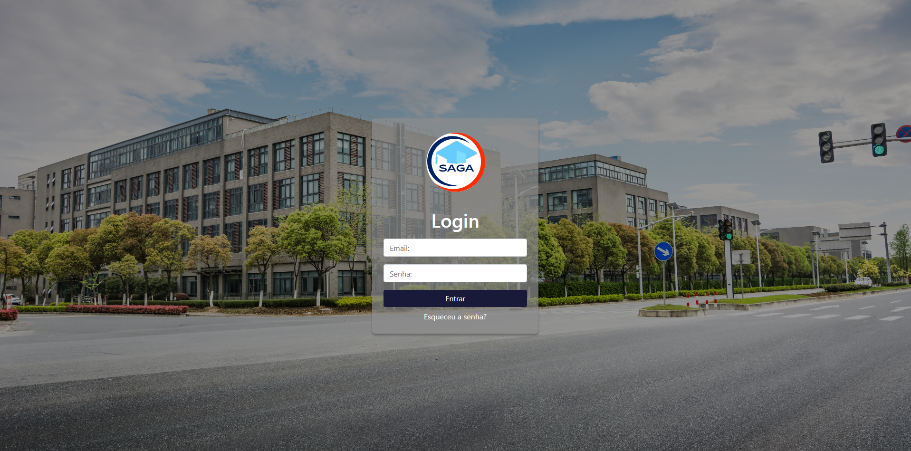
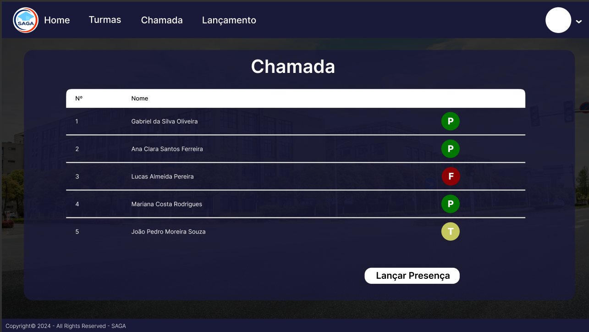

# 🏫 SAGA — Sistema de Administração e Gestão Acadêmica

🌐 [English](../../README.md) | **Português (Brasil)**



O **SAGA** (_Sistema de Administração e Gestão Acadêmica_) é uma aplicação web para escolas de
pequeno e médio porte. A secretaria cadastra cursos, matérias, turmas e usuários; os professores
fazem a chamada e lançam notas; os alunos acompanham suas matérias, notas e frequência.

> 🚧 **Status:** o sistema roda localmente e está passando por uma refatoração planejada do backend,
> do banco de dados, da segurança e do front-end. O trabalho é acompanhado em
> [issues do GitHub](https://github.com/ftfariasdev/SAGA/issues) — veja
> [Status do projeto](#status-do-projeto). Os defeitos conhecidos estão listados em
> [docs/pt-BR/known-issues.md](known-issues.md).

---

## Índice

- [Sobre o projeto](#sobre-o-projeto)
- [Funcionalidades por perfil](#funcionalidades-por-perfil)
- [Imagens](#imagens)
- [Tecnologias](#tecnologias)
- [Estrutura do repositório](#estrutura-do-repositório)
- [Início rápido](#início-rápido)
- [Documentação](#documentação)
- [Como contribuir](#como-contribuir)
- [Status do projeto](#status-do-projeto)
- [Desenvolvedores](#desenvolvedores)
- [Licença](#licença)

---

## Sobre o projeto

O SAGA substitui planilhas e registros em papel por um único sistema web, compartilhado entre
secretaria, professores e alunos. Cada perfil faz login e cai na sua própria área do site, com as
telas e ações que cabem àquele papel.

Ele é dividido em três partes:

| Parte          | O que é                                                             | Onde roda               |
| -------------- | ------------------------------------------------------------------- | ----------------------- |
| `Front-End/`   | Páginas estáticas (HTML, CSS, JavaScript puro), uma área por perfil | `http://127.0.0.1:5500` |
| `Back-end/`    | API REST em Node.js + Express + Prisma                              | `http://localhost:8081` |
| Banco de dados | PostgreSQL 16 em um container Docker                                | `localhost:5432`        |

Como as partes conversam entre si está descrito em
[docs/pt-BR/architecture.md](architecture.md).

---

## Funcionalidades por perfil

| Perfil         | O que pode fazer                                                                                                                                         |
| -------------- | -------------------------------------------------------------------------------------------------------------------------------------------------------- |
| **Secretaria** | Cadastrar, editar e remover cursos, matérias, turmas e usuários (alunos, professores, secretaria); vincular professores a turmas; trocar alunos de turma |
| **Professor**  | Ver suas turmas e matérias; fazer a chamada por turma e data; lançar notas por matéria, tipo de avaliação e bimestre                                     |
| **Aluno**      | Ver as matérias do seu curso, as notas por módulo e a frequência do dia                                                                                  |

Todos os perfis fazem login com e-mail e senha (ou Google) e podem ver o próprio perfil.

> ⚠️ O boletim do aluno por bimestre está quebrado no momento — veja
> [docs/pt-BR/known-issues.md](known-issues.md).

---

## Imagens

### Chamada (professor)



---

## Tecnologias

**Backend**

- [Node.js 22 LTS](https://nodejs.org) com ES modules
- [Express 4](https://expressjs.com) — servidor HTTP e rotas
- [Prisma 6](https://www.prisma.io) — ORM e migrations
- [PostgreSQL 16](https://www.postgresql.org) em [Docker Compose](https://docs.docker.com/compose/)
- [jsonwebtoken](https://www.npmjs.com/package/jsonwebtoken) + [bcryptjs](https://www.npmjs.com/package/bcryptjs)
  — autenticação
- [google-auth-library](https://www.npmjs.com/package/google-auth-library) — "Entrar com Google"

**Frontend**

- HTML5, CSS3 e JavaScript puro (ES6+), sem etapa de build
- Bootstrap 4.5 (página de login), Chart.js e FullCalendar (páginas de frequência do aluno),
  carregados via CDN

**Ferramentas**

- ESLint 10 e Prettier 3, configurados na raiz do repositório
- GitHub Actions rodando lint e verificação de formatação em `main` e `develop`

---

## Estrutura do repositório

```text
SAGA/
├── Back-end/              # API REST — veja docs/pt-BR/back-end.md
│   ├── server.js          # ponto de entrada: CORS, parsing de JSON, rotas
│   ├── src/Routes/        # roteadores: geral, aluno, prof, sec
│   ├── src/controller/    # handlers das requisições (chamam o Prisma direto)
│   ├── src/middlewares/   # autenticação JWT
│   ├── prisma/            # schema.prisma + migrations
│   ├── tests/             # requisições manuais (arquivos .http)
│   └── docker-compose.yml # container do PostgreSQL 16
├── Front-End/             # páginas estáticas — veja docs/pt-BR/front-end.md
│   ├── Login/ Aluno/ Professor/ Secretaria/
│   └── Js/ "Css Base"/ Img/
├── docs/                  # documentação (EN-US); todas as traduções PT-BR ficam em docs/pt-BR/
├── .github/               # workflows de CI e template de pull request
├── CLAUDE.md              # guia para agentes de IA que programam no repositório
├── CONTRIBUTING.md        # branches, commits e pull requests
└── eslint.config.js, .prettierrc, package.json   # ferramentas de lint e formatação
```

---

## Início rápido

Para quem já tem **Node.js 22** e **Docker** instalados. Vai configurar uma máquina do zero (macOS,
Linux Mint ou Windows)? Siga o **[docs/pt-BR/local-environment.md](local-environment.md)**.

### 1. API e banco de dados

```bash
git clone https://github.com/ftfariasdev/SAGA.git
cd SAGA/Back-end
npm install
cp .env.example .env        # Windows: copy .env.example .env
```

Gere um segredo e cole em `JWT_SECRET` no `.env`:

```bash
node -e "console.log(require('crypto').randomBytes(32).toString('hex'))"
```

```bash
docker compose up -d        # sobe o PostgreSQL 16 em container
npx prisma migrate dev      # cria as tabelas
npm run dev                 # API em http://localhost:8081
```

Confira: `curl http://localhost:8081/health` deve devolver `{"status":"UP",...}`.

> ⚠️ Mantenha `PORT=8081` no `.env`: os scripts do front-end chamam `http://localhost:8081` direto.

### 2. Primeiro usuário

O banco começa vazio e todas as telas exigem login. Crie a primeira conta de secretaria pela única
rota pública, feita para esse bootstrap:

```bash
curl -X POST http://localhost:8081/sec/cadSecretaria \
  -H "Content-Type: application/json" \
  -d '{"nome":"Secretaria Teste","email":"secretaria@saga.local","senha":"senha123","dt_nasc":"2000-01-15T00:00:00.000Z","telefone":"11999990000","cpf":"00000000191","ft_perfil":""}'
```

Depois é só entrar com `secretaria@saga.local` / `senha123`.

### 3. Front-end

Abra a pasta `Front-End` no VS Code e inicie o `index.html` com a extensão
[Live Server](https://marketplace.visualstudio.com/items?itemName=ritwickdey.LiveServer).

> ⚠️ O front-end precisa ser servido exatamente em `http://127.0.0.1:5500` — é a única origem
> liberada na configuração de CORS do backend. Abrir o arquivo direto (`file://`) não funciona.

### 4. Lint e formatação (raiz do repositório)

```bash
npm install
npm run lint
npm run format:check
```

---

## Documentação

Todo documento existe em português do Brasil e em inglês (EUA). Os arquivos em inglês ficam ao lado
do que descrevem; **todas as traduções em português ficam nesta pasta, `docs/pt-BR/`**, com os mesmos
nomes de arquivo.

### Por onde começar

| Você está…                 | Leia, nesta ordem                                                                                                                                          |
| -------------------------- | ---------------------------------------------------------------------------------------------------------------------------------------------------------- |
| Chegando agora no projeto  | Este README → [Ambiente local](local-environment.md) → [Arquitetura](architecture.md) → [Glossário](glossary.md) → [Problemas conhecidos](known-issues.md) |
| Trabalhando no backend     | [Arquitetura](architecture.md) → [Referência da API](api-reference.md) → [Banco de dados](database.md) → [README do Back-end](back-end.md)                 |
| Trabalhando no front-end   | [README do Front-End](front-end.md) → [Referência da API](api-reference.md) → [Arquitetura](architecture.md) (fluxo de autenticação)                       |
| Abrindo ou revisando um PR | [Como contribuir](CONTRIBUTING.md) → [template de pull request](../../.github/pull_request_template.md)                                                    |
| Um agente de IA            | [CLAUDE.md](../../CLAUDE.md) ([tradução](ai-agents.md))                                                                                                    |

### Todos os documentos

| Documento                                                          | O que você encontra                                               | EN-US                                         |
| ------------------------------------------------------------------ | ----------------------------------------------------------------- | --------------------------------------------- |
| [Ambiente local](local-environment.md)                             | Instalar o Docker e rodar tudo localmente, resolução de problemas | [Local environment](../local-environment.md)  |
| [Arquitetura](architecture.md)                                     | Como front-end, API e banco se encaixam; fluxo de autenticação    | [Architecture](../architecture.md)            |
| [Referência da API](api-reference.md)                              | Todas as rotas HTTP, seus parâmetros e qual tela usa cada uma     | [API reference](../api-reference.md)          |
| [Banco de dados](database.md)                                      | Modelo de dados, diagrama ER e histórico de migrations            | [Database](../database.md)                    |
| [Glossário](glossary.md)                                           | Os termos do domínio usados no código, explicados                 | [Glossary](../glossary.md)                    |
| [Problemas conhecidos](known-issues.md)                            | Defeitos conhecidos e dívida técnica, ligados ao backlog          | [Known issues](../known-issues.md)            |
| [README do Back-end](back-end.md)                                  | Estrutura da API, scripts e variáveis de ambiente                 | [Back-end README](../../Back-end/README.md)   |
| [README do Front-End](front-end.md)                                | Mapa de páginas, scripts compartilhados e dados de sessão         | [Front-End README](../../Front-End/README.md) |
| [Como contribuir](CONTRIBUTING.md)                                 | Branches, Conventional Commits e pull requests                    | [Contributing](../../CONTRIBUTING.md)         |
| [Template de pull request](../../.github/pull_request_template.md) | Descrição e checklist pré-preenchidos do PR                       | — (um único arquivo bilíngue)                 |
| [Guia para agentes de IA](ai-agents.md)                            | Regras e mapa do código para agentes de IA                        | [CLAUDE.md](../../CLAUDE.md)                  |

Como a documentação é organizada e nomeada: [Como contribuir § 6](CONTRIBUTING.md#6-regras-de-documentação).

---

## Como contribuir

As contribuições seguem o padrão descrito em **[docs/pt-BR/CONTRIBUTING.md](CONTRIBUTING.md)**:

1. Escolha uma issue do [backlog](https://github.com/ftfariasdev/SAGA/issues).
2. Crie uma branch [Git Flow](CONTRIBUTING.md#1-modelo-de-branches--git-flow) a partir de `develop`
   — ex.: `git flow bugfix start boletim-aluno`, que cria `bugfix/boletim-aluno`.
3. Faça commits seguindo [Conventional Commits](https://www.conventionalcommits.org/pt-br/) — ex.:
   `fix(notas): corrige boletim do aluno`.
4. Publique a branch e abra um pull request para `develop` — um PR por task. Não rode o `finish` na
   sua máquina: ele faz o merge sem revisão nem CI.

---

## Status do projeto

O backlog da refatoração é organizado por prefixo de ID. Cada issue descreve o problema, como deve
ficar, como testar e suas dependências.

| Prefixo | Foco                                                                                                         | Issues    |
| ------- | ------------------------------------------------------------------------------------------------------------ | --------- |
| `C`     | Correções urgentes de segurança (cadastro público de secretaria, segredos commitados)                        | #1, #2    |
| `F`     | Fundação: tratamento de erros, configuração, Prisma, validação, logging, limpeza, ferramentas                | #3 – #12  |
| `P`     | Paginação, ordenação e filtro                                                                                | #13       |
| `S`     | Segurança: JWT, autorização por perfil, headers e rate limiting, IDOR, cadastro pelo Google                  | #14 – #18 |
| `M`     | Novo core do schema do banco e migração                                                                      | #19 – #21 |
| `D`     | Migração do backend domínio a domínio (auth, cursos, matérias, turmas, usuários, chamada, notas, resultados) | #22 – #30 |
| `T`     | Testes automatizados                                                                                         | #31 – #33 |
| `DOC`   | Documentação OpenAPI                                                                                         | #34       |
| `CI`    | Integração contínua e padrão de contribuição                                                                 | #35, #36  |
| `FE`    | Front-end: cliente HTTP central e atualização das telas                                                      | #37 – #42 |

---

## Desenvolvedores

Desenvolvido por [Felipe Farias](https://github.com/Felipe-dev01), Brenno Mello, Jéssica Oliveira e
Hugo Rocha.

---

## Licença

A versão anterior deste README declarava a licença MIT, mas o repositório ainda não tem um arquivo
`LICENSE` e o `Back-end/package.json` declara ISC. Até a equipe adicionar o arquivo `LICENSE`, os
termos de uso estão indefinidos — veja [docs/pt-BR/known-issues.md](known-issues.md).
