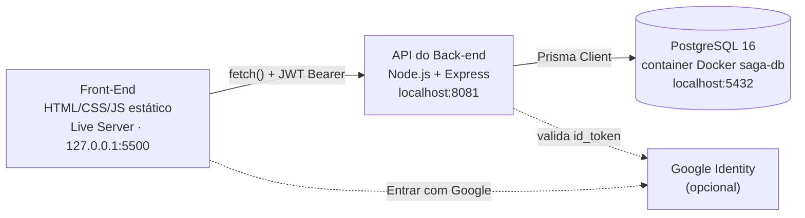
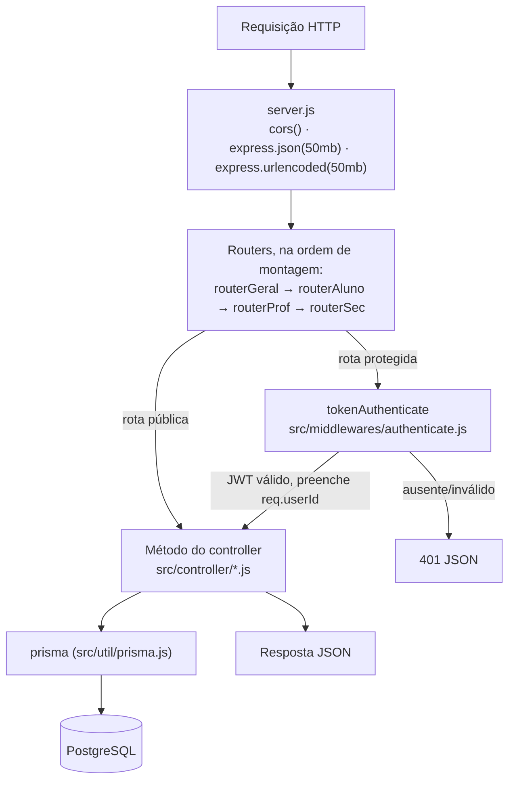
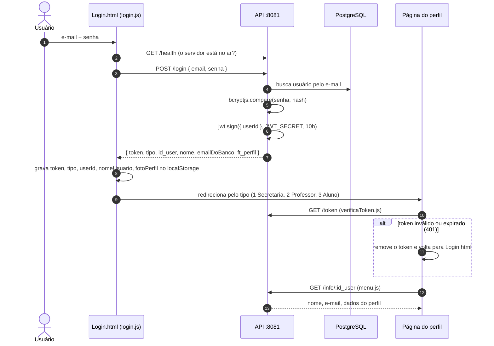
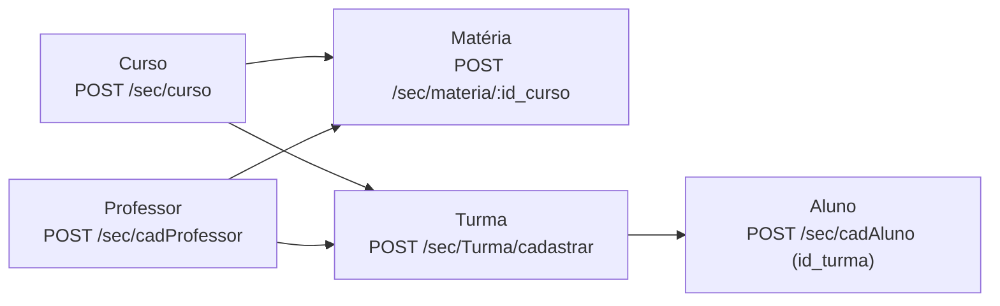

# Arquitetura do SAGA

🌐 [English](../architecture.md) | **Português (Brasil)**

Como o sistema está montado **hoje** e para onde o backlog está levando. Leia antes de mexer em
uma parte do código que você ainda não conhece.

> 📌 Este documento descreve o código como ele é, com as imperfeições. Os defeitos aparecem
> resumidos aqui e são acompanhados em [known-issues.md](known-issues.md) e nas
> [issues do GitHub](https://github.com/ftfariasdev/SAGA/issues).

## Índice

1. [Visão geral](#1-visão-geral)
2. [Estrutura do repositório](#2-estrutura-do-repositório)
3. [Back-end](#3-back-end)
4. [Front-end](#4-front-end)
5. [Fluxo de autenticação e sessão](#5-fluxo-de-autenticação-e-sessão)
6. [Perfis de usuário](#6-perfis-de-usuário)
7. [Principais fluxos do domínio](#7-principais-fluxos-do-domínio)
8. [Para onde a arquitetura está indo](#8-para-onde-a-arquitetura-está-indo)
9. [Onde mudar o quê](#9-onde-mudar-o-quê)

---

## 1. Visão geral

O SAGA é formado por três partes independentes que conversam por HTTP e SQL. Não há etapa de build
nem renderização no servidor.



| Parte     | Tecnologia                           | Endereço                | Detalhes                                |
| --------- | ------------------------------------ | ----------------------- | --------------------------------------- |
| Front-end | HTML5, CSS3, JavaScript puro (ES6+)  | `http://127.0.0.1:5500` | [docs/pt-BR/front-end.md](front-end.md) |
| API       | Node.js 22, Express 4, Prisma 6, JWT | `http://localhost:8081` | [docs/pt-BR/back-end.md](back-end.md)   |
| Banco     | PostgreSQL 16 no Docker (`saga-db`)  | `localhost:5432`        | [database.md](database.md)              |

Dois endereços estão **fixos no código** e precisam bater para o sistema funcionar:

- O front-end chama `http://localhost:8081` em todos os scripts de página, então a API precisa
  rodar com `PORT=8081`.
- O CORS da API, em [`Back-end/server.js`](../../Back-end/server.js), só aceita a origem
  `http://127.0.0.1:5500`. Abrir as páginas por `file://` ou por `localhost:5500` não funciona.

O passo a passo de instalação está em [local-environment.md](local-environment.md).

---

## 2. Estrutura do repositório

```text
SAGA/
├── .github/
│   ├── workflows/            lint.yml, prettier.yml — rodam em push/PR para main e develop
│   └── pull_request_template.md
├── Back-end/                 API REST (com package.json próprio)
│   ├── prisma/
│   │   ├── schema.prisma     modelo de dados
│   │   └── migrations/       histórico versionado do schema
│   ├── src/
│   │   ├── Routes/           routesGeral.js, routesAluno.js, routesProf.js, routesSec.js
│   │   ├── controller/       loginController.js, commonController.js, alunoController.js,
│   │   │                     profController.js, secController.js
│   │   ├── middlewares/      authenticate.js (verificação do JWT)
│   │   └── util/             prisma.js (PrismaClient compartilhado)
│   ├── tests/                coleções de requisições *.http (manuais, não são testes automatizados)
│   ├── server.js             ponto de entrada
│   ├── docker-compose.yml    container do PostgreSQL
│   ├── .env.example          modelo das variáveis de ambiente
│   └── cadMateria.js, fixMateria.js, sync_professores_turmas.js, baseline.sql  (scripts soltos / legado)
├── Front-End/                site estático (sem package.json, sem build)
│   ├── index.html            redireciona para Login/Login.html
│   ├── Login/  Aluno/  Professor/  Secretaria/   uma pasta por perfil: Page/, Js/, Css/ (css/)
│   ├── Js/                   scripts compartilhados: verificaToken.js, menu.js, mascaras.js
│   ├── Css Base/             estilos compartilhados
│   └── Img/
├── docs/                     documentação (EN-US); docs/pt-BR/ guarda todas as traduções PT-BR
├── eslint.config.js          configuração flat do ESLint para o repositório todo
├── .prettierrc               regras do Prettier
├── package.json              raiz: só ferramentas de lint/formatação (sem código da aplicação)
├── README.md  CONTRIBUTING.md  CLAUDE.md
```

O `package.json` da raiz existe só para rodar `npm run lint` e `npm run format:check` nas duas
aplicações. As dependências da API ficam em `Back-end/package.json`.

---

## 3. Back-end

### Caminho de uma requisição



O **`server.js`** carrega o `.env` com `dotenv`, configura o CORS (origem única
`http://127.0.0.1:5500`), aumenta o limite do corpo para 50 MB (as fotos de perfil trafegam como
texto), monta os quatro routers e escuta na `PORT`. Ele também exporta o `JWT_SECRET`, que o
`loginController.js` importa.

> O `server.js` declara um `GET /health` próprio, mas o `routerGeral` é montado antes e já
> responde `/health` com `{ "status": "UP", "timestamp": "...", "version": "1.0.0" }`. O handler do
> `server.js` nunca é alcançado.

O **`tokenAuthenticate`** lê `Authorization: Bearer <token>`, valida com o `JWT_SECRET` e guarda o
campo `userId` em `req.userId`. Ele **não** verifica o perfil: qualquer usuário logado consegue
chamar qualquer rota protegida, inclusive `/sec/*`. Autorização por perfil está planejada em
[S1] #14 e [S2] #15.

Os **controllers** são classes cujos métodos recebem `(req, res)`, validam a entrada na mão, chamam
o Prisma diretamente e montam a resposta. Não existe camada de serviço nem de repositório, então as
regras de negócio moram dentro dos controllers — por exemplo, a regra "o professor atribuído a uma
matéria é vinculado a todas as turmas daquele curso" está escrita dentro de
`SecController.cadMateria` e `editarMateria`.

O **`src/util/prisma.js`** exporta um único `PrismaClient` compartilhado. Os scripts de manutenção
criam o próprio cliente ([F4] #6).

### Routers

| Router        | Arquivo          | Controller(s)                         | Caminhos                                                               | Rotas | Usado por             |
| ------------- | ---------------- | ------------------------------------- | ---------------------------------------------------------------------- | ----: | --------------------- |
| `routerGeral` | `routesGeral.js` | `LoginController`, `commonController` | `/login`, `/login/google`, `/token`, `/health`, `/info`, `/editarInfo` |     6 | Todos os perfis       |
| `routerAluno` | `routesAluno.js` | `AlunoController`                     | `/aluno/*`                                                             |     6 | Páginas do aluno      |
| `routerProf`  | `routesProf.js`  | `ProfController`                      | `/prof/*`, `/professor/user/:id_user`                                  |     9 | Páginas do professor  |
| `routerSec`   | `routesSec.js`   | `SecController`                       | `/sec/*`                                                               |    33 | Páginas da secretaria |

Rotas públicas (sem token): `POST /login`, `POST /login/google`, `GET /health` e
`POST /sec/cadSecretaria` (aberta de propósito para criar a primeira conta — será fechada em
[C1] #1). Todas as rotas estão listadas em [api-reference.md](api-reference.md).

### O que saber antes de editar

- **Dois jeitos de ligar o método.** `routesAluno.js` e `routesProf.js` envolvem cada chamada em
  uma arrow function (`(req, res) => controller.metodo(req, res)`), então o `this` funciona.
  `routesGeral.js` e `routesSec.js` passam a referência do método direto
  (`secController.cadCurso`), então o `this` é `undefined` dentro desses métodos. Nenhum método usa
  `this` hoje — se você criar um método auxiliar e chamá-lo com `this.auxiliar()` num desses
  controllers, vai quebrar.
- **Erros assíncronos não são tratados globalmente.** O Express 4 não captura promises rejeitadas.
  Quando um handler sem `try/catch` próprio (por exemplo o CRUD de curso no `SecController` e o
  `LoginController.auth`) recebe um erro do Prisma, a rejeição fica sem tratamento e o Node.js (15+)
  **derruba o processo inteiro da API**. Um error handler global está planejado em [F1] #3.
- **O formato do corpo de erro varia**: aparecem `{ erro }`, `{ error }`, `{ message }` e
  `{ mensagem }`.
- **Duas bibliotecas de bcrypt**: o `SecController` gera o hash com `bcrypt` e o `LoginController`
  compara com `bcryptjs` ([F10] #12).
- **Arquivos soltos em `Back-end/`**: `cadMateria.js` (não é importado em lugar nenhum),
  `src/controller/profController_fixed.js` (vazio) e os scripts de linha de comando
  `fixMateria.js` e `sync_professores_turmas.js`. Veja
  [known-issues.md](known-issues.md) e [F9] #11.

---

## 4. Front-end

- **HTML/CSS/JS puro**, sem framework, sem bundler, sem `package.json`. Cada página HTML carrega
  seus scripts com `<script src>`.
- **Uma pasta por perfil** — `Login/`, `Aluno/`, `Professor/`, `Secretaria/` — cada uma com
  `Page/` (HTML), `Js/` (scripts da página) e `Css/` (`css/` na `Secretaria`).
- **Código compartilhado** em `Front-End/Js/`:
  - `verificaToken.js` — ao carregar a página, chama `GET /token`; se receber `401`, remove o token
    e volta para o login.
  - `menu.js` — preenche o cabeçalho (nome, e-mail, foto) a partir do `localStorage` e atualiza com
    `GET /info/:id_user`; cuida do botão de sair (`localStorage.clear()`).
  - `mascaras.js` — máscaras de CPF e telefone.
- **Estilos compartilhados** em `Front-End/Css Base/` (layout base, tabelas, modal, barra de
  pesquisa).
- **Chamadas à API**: cada script de página faz `fetch('http://localhost:8081/...')` com a URL
  escrita ali mesmo e o token lido do `localStorage`. Ainda não existe cliente HTTP central
  ([FE1] #37).
- **Bibliotecas via CDN**:
  - `Login/Login.html`: Bootstrap 4.5.2, jQuery 3.5.1 slim, Popper 1.16.1 e Google Identity
    Services.
  - `Aluno/Page/Freq1.html` e `Freq2.html`: Chart.js, chartjs-plugin-datalabels 2.2.0 e
    FullCalendar 6.1.8.

O mapa completo página → script → endpoint está em
[docs/pt-BR/front-end.md](front-end.md).

---

## 5. Fluxo de autenticação e sessão



Pontos principais:

- **Token**: JWT HS256 assinado com `JWT_SECRET`, payload só com `{ userId }`, expira em **10
  horas**. Não há refresh token nem logout no servidor; sair apenas limpa o `localStorage`.
- **Destino do redirecionamento**: `tipo` `1` → `Secretaria/Page/HomeSecretaria.html`, `2` →
  `Professor/Page/HomeProfessor.html`, `3` → `Aluno/Page/HomeAluno.html`.
- **Chaves do `localStorage`** gravadas no login: `token`, `tipo`, `userId`, `nomeUsuario`,
  `emailUsuario`, `fotoPerfil`. A API devolve o e-mail como `emailDoBanco`, mas o script do login
  por senha lê `data.email`, então o `emailUsuario` só é preenchido quando o `menu.js` chama `/info`.
- **Login com Google**: o botão do Google devolve um `id_token`; o front-end envia para
  `POST /login/google` e a API valida com a `google-auth-library` usando o `GOOGLE_CLIENT_ID`. Se o
  e-mail não existir, a API **cria um usuário com `tipo: 0`** e telefone/CPF provisórios
  ([S5] #18). O front-end não tem página inicial para `tipo 0`, então esse usuário volta para o
  login.
- **Autorização**: nenhuma além de "tem token válido". Perfil dentro do token e middleware por
  perfil estão planejados em [S1] #14 e [S2] #15; o IDOR de `/info/:id_user` e `PUT /editarInfo` é
  tratado em [S4] #17.

---

## 6. Perfis de usuário

Toda pessoa é uma linha em `user`; a coluna `tipo` diz qual tabela de perfil ela também tem.

| `tipo` | Perfil                         | Tabela de perfil | O que faz na interface                                                                                                            |
| -----: | ------------------------------ | ---------------- | --------------------------------------------------------------------------------------------------------------------------------- |
|    `0` | Conta criada pelo login Google | —                | Nada: não existe página inicial para esse valor.                                                                                  |
|    `1` | Secretaria                     | `secretaria`     | Gerencia cursos, matérias, turmas e usuários; vincula professores e alunos às turmas; edita o próprio perfil (`editarInfo.html`). |
|    `2` | Professor                      | `professor`      | Vê suas turmas e matérias, faz a chamada e lança notas.                                                                           |
|    `3` | Aluno                          | `aluno`          | Vê as matérias do curso, frequência e notas; consulta o próprio perfil (só leitura).                                              |

> ⚠️ Esses valores ficam gravados no banco. **Nunca renumere** — as linhas existentes mudariam de
> perfil sem ninguém perceber.

---

## 7. Principais fluxos do domínio

Os termos do domínio estão em português no código; veja o [glossary.md](glossary.md).

### A secretaria monta a estrutura acadêmica



1. Cadastrar um **curso**.
2. Cadastrar as **matérias** do curso. Se a matéria for criada ou editada com um professor
   (`id_prof`), a API vincula esse professor a **todas as turmas do curso** por meio de
   `professor_turma`.
3. Cadastrar as **turmas** do curso, opcionalmente já com um professor.
4. Cadastrar os usuários: `cadAluno` (com `id_turma`), `cadProfessor`, `cadSecretaria`. Cada um cria
   uma linha em `user` e a linha de perfil correspondente.

### O professor faz a chamada

`POST /prof/chamada` com `{ id_turma, data, presencas: [{ id_aluno, presente }] }`. A API confere se
o professor está vinculado à turma, busca ou cria uma **chamada** para (professor, turma, data e
hora exatas) e cria ou atualiza uma **presença** por aluno. A semântica de data está sendo
unificada em [D6] #28.

### O professor lança notas

`POST /prof/lancarNotas` com `{ id_turma, id_materia, tipo_avaliacao, bimestre, notas: [{ id_aluno, valor }] }`.
O professor precisa estar vinculado à turma **e** ser o `id_prof` da matéria. Os valores precisam
estar entre 0 e 10. Para cada aluno a API cria uma linha em **nota** (professor, turma, matéria,
tipo de avaliação, bimestre) com uma linha em **nota_aluno** guardando o valor. Lançar de novo cria
linhas novas; nada é atualizado.

### O que o aluno consulta

- `GET /aluno/listMateria` — matérias do curso do aluno.
- `GET /aluno/modulo/:modulo` — matérias cujo `codigo` começa com `:modulo`, com as notas cujo
  `tipo_avaliacao` é `B1`/`B2`.
- `GET /aluno/presencas-dia?data=` — presença em um dia.
- `GET /aluno/bimestre/:bimestre` (boletim) e `GET /aluno/frequencia-geral` apontam para métodos de
  controller que **não existem**, então falham. Veja
  [known-issues.md](known-issues.md) e [D7] #29.

---

## 8. Para onde a arquitetura está indo

O backlog é um conjunto de issues no GitHub, cada uma com o prefixo do seu épico. Ele leva a API
para um desenho em camadas, com validação, tratamento central de erros, autorização, testes
automatizados e CI, mantendo o contrato HTTP estável para o front-end. **Tudo isso está planejado,
não feito.**

| Prefixo | Épico                           | Escopo (a partir dos títulos das issues)                                                                                                                                                                                                             |
| ------- | ------------------------------- | ---------------------------------------------------------------------------------------------------------------------------------------------------------------------------------------------------------------------------------------------------- |
| `C`     | Correções urgentes de segurança | Fechar o cadastro público de secretaria ([C1] #1); remover tokens e senhas reais do repositório e rotacionar o segredo ([C4] #2).                                                                                                                    |
| `F`     | Fundação                        | Handlers async + error handler global, configuração validada, separar `app.js`/`server.js`, PrismaClient único, erros de domínio, validação com Joi, ESLint/Prettier, logging estruturado, código morto, metadados do package ([F1] #3 – [F10] #12). |
| `S`     | Segurança                       | Perfil no token, autorização por perfil, helmet/rate limit/limite de payload, correção de IDOR, fechar o auto-cadastro do Google ([S1] #14 – [S5] #18).                                                                                              |
| `P`     | Performance                     | Paginação, ordenação e filtro padronizados nas listagens ([P2] #13).                                                                                                                                                                                 |
| `M`     | Núcleo do schema                | Novo núcleo do schema com migration única, religar o back-end, API falando `id_user` ([M0] #19, [M0b] #20, [M7] #21).                                                                                                                                |
| `D`     | Migração por domínio            | Migrar domínio a domínio: auth (piloto), cursos, matérias, turmas, usuários, chamadas, notas, resultados ([D1] #22 – [D8] #30).                                                                                                                      |
| `T`     | Testes                          | Vitest + Supertest + banco de teste, testes de autenticação, testes de integração ([T1] #31 – [T3] #33).                                                                                                                                             |
| `DOC`   | Documentação da API             | Especificação OpenAPI ([DOC1] #34).                                                                                                                                                                                                                  |
| `CI`    | Integração contínua             | Pipeline de CI ([CI1] #35); padrão de contribuição ([CI2] #36).                                                                                                                                                                                      |
| `FE`    | Front-end                       | Cliente HTTP central e login, depois cada grupo de telas ([FE1] #37 – [FE6] #42).                                                                                                                                                                    |

Veja todas em <https://github.com/ftfariasdev/SAGA/issues>. Como pegar uma task e abrir PR está no
[docs/pt-BR/CONTRIBUTING.md](CONTRIBUTING.md).

---

## 9. Onde mudar o quê

| Quero…                               | Mudar                                                                                                                                                    | Atualizar também                                                                            |
| ------------------------------------ | -------------------------------------------------------------------------------------------------------------------------------------------------------- | ------------------------------------------------------------------------------------------- |
| Criar ou alterar um endpoint         | `Back-end/src/Routes/routes<Perfil>.js` + o método em `Back-end/src/controller/<perfil>Controller.js`                                                    | [api-reference.md](api-reference.md), o script de página que chama, `Back-end/tests/*.http` |
| Alterar o schema do banco            | `Back-end/prisma/schema.prisma`, depois `npx prisma migrate dev --name <snake_case>`                                                                     | [database.md](database.md)                                                                  |
| Alterar login, token ou sessão       | `Back-end/src/controller/loginController.js`, `Back-end/src/middlewares/authenticate.js`, `Front-End/Login/Js/login.js`, `Front-End/Js/verificaToken.js` | Seção 5 deste documento                                                                     |
| Alterar a porta ou a URL base da API | `PORT` no `Back-end/.env` **e** cada `fetch` em `Front-End/**/Js/*.js` (fixo hoje; cliente central planejado em [FE1] #37)                               | [local-environment.md](local-environment.md)                                                |
| Liberar outra origem do front-end    | `cors({ origin })` em `Back-end/server.js`                                                                                                               | [local-environment.md](local-environment.md)                                                |
| Criar uma página para um perfil      | `Front-End/<Perfil>/Page/*.html` + `Front-End/<Perfil>/Js/*.js`; incluir `../../Js/verificaToken.js` e `../../Js/menu.js`                                | [docs/pt-BR/front-end.md](front-end.md)                                                     |
| Criar uma variável de ambiente       | `Back-end/.env.example` (sem segredo real) e o seu `.env`                                                                                                | [local-environment.md](local-environment.md)                                                |
| Alterar regras de lint ou formatação | `eslint.config.js`, `.prettierrc`                                                                                                                        | [docs/pt-BR/CONTRIBUTING.md](CONTRIBUTING.md)                                               |
| Registrar um termo do domínio        | —                                                                                                                                                        | [glossary.md](glossary.md)                                                                  |
